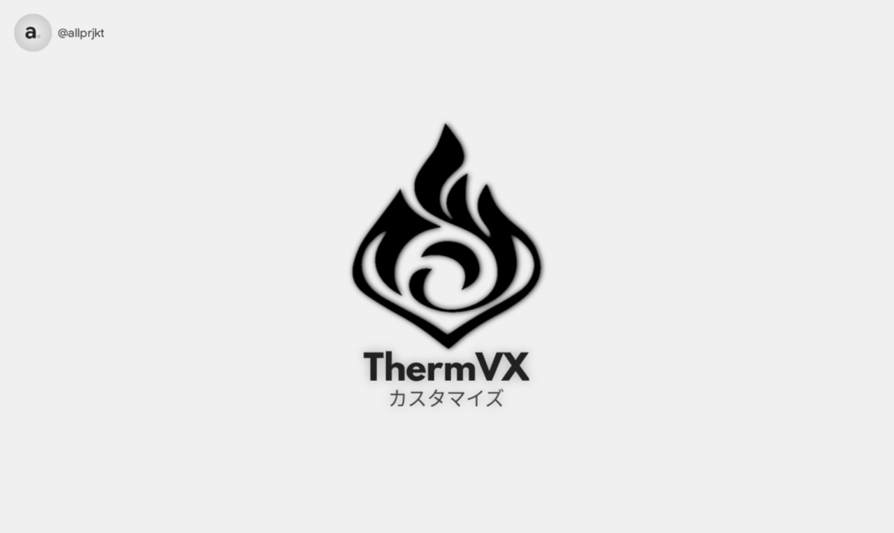

## Eliminates thermal limitations for unrestricted usage !


## 🌡️ ThermVX

</a>
<p>ThermVX is a module that removes thermal limitations, enabling your device to maintain high performance during heavy use. It prevents slowdowns from heat, ensuring smooth operation for demanding tasks like gaming and intensive apps.</p>

## ❓ Requirements
- Basic knowledge of Android modifications.
- Android device with Root access **(Magisk/KernelSU/APatch)**.

## 🤓 Installation
1. Download the latest release from the [**Releases Page**](https://github.com/al4uu/ThermVX/releases)
2. Install the module via **Magisk/KernelSU/APatch** Manager.
3. Reboot your device for the changes to take effect.

## 🤔 Changelogs
- Read full changelog [**here**](https://github.com/al4uu/ThermVX/blob/fx/changelog.md)

## ⚠️ Pay Attention

<p>
The developer is not responsible for any damages caused by using this module. Some apps or games may experience issues or fail to work properly. Do with your own risk and proceed with caution.
</p>

## 📋 License
This project is licensed under the **MIT License**. 
```text
Copyright (c) 2025 al マス

Permission is hereby granted, free of charge, to any person obtaining a copy
of this software and associated documentation files (the "Software"), to deal
in the Software without restriction, including without limitation the rights
to use, copy, modify, merge, publish, distribute, sublicense, and/or sell
copies of the Software, and to permit persons to whom the Software is
furnished to do so, subject to the following conditions:

The above copyright notice and this permission notice shall be included in all
copies or substantial portions of the Software.

THE SOFTWARE IS PROVIDED "AS IS", WITHOUT WARRANTY OF ANY KIND, EXPRESS OR
IMPLIED, INCLUDING BUT NOT LIMITED TO THE WARRANTIES OF MERCHANTABILITY,
FITNESS FOR A PARTICULAR PURPOSE AND NONINFRINGEMENT. IN NO EVENT SHALL THE
AUTHORS OR COPYRIGHT HOLDERS BE LIABLE FOR ANY CLAIM, DAMAGES OR OTHER
LIABILITY, WHETHER IN AN ACTION OF CONTRACT, TORT OR OTHERWISE, ARISING FROM,
OUT OF OR IN CONNECTION WITH THE SOFTWARE OR THE USE OR OTHER DEALINGS IN THE
SOFTWARE.
